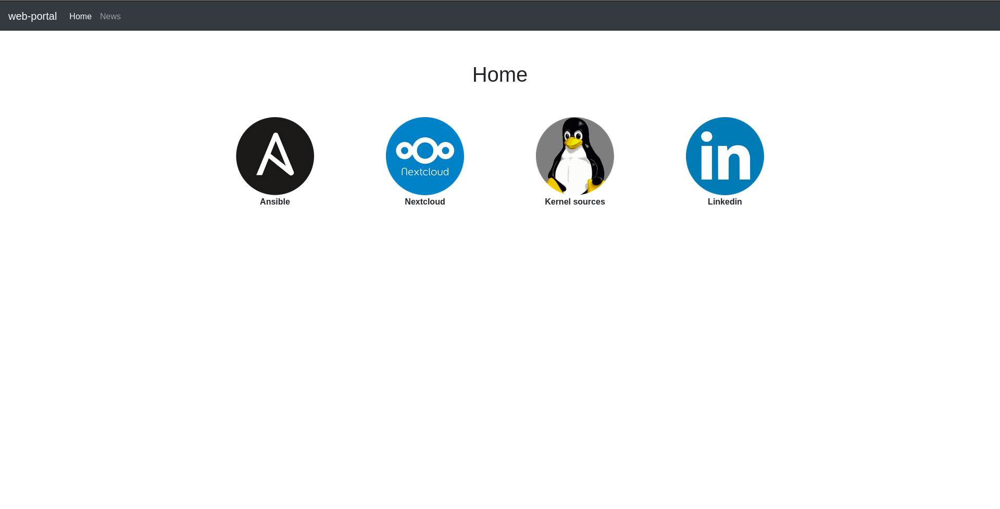

# web-portal
Web portal with clickable images pointing to different web applications



## Build docker image
```shell
docker build . -t adieperi/web-portal --no-cache
```

## Run dev server
You can run and test the application with docker by executing the command 
```shell
docker-compose up -d
```

## Push to gh-pages
```shell
git subtree push --prefix dist origin gh-pages
```
